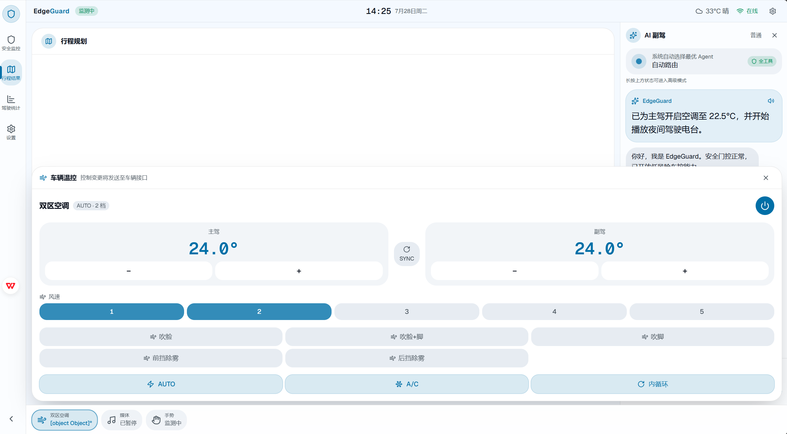
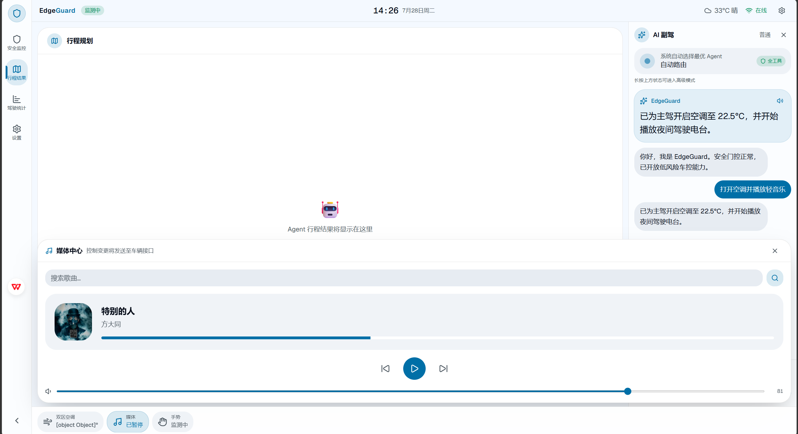
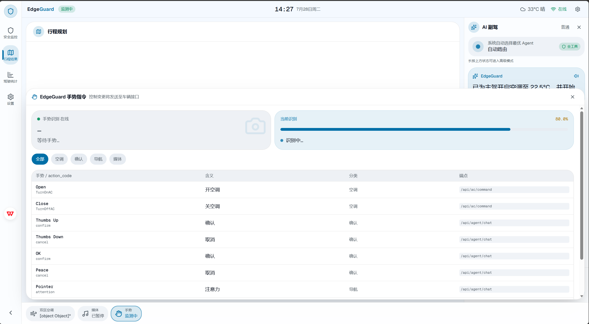
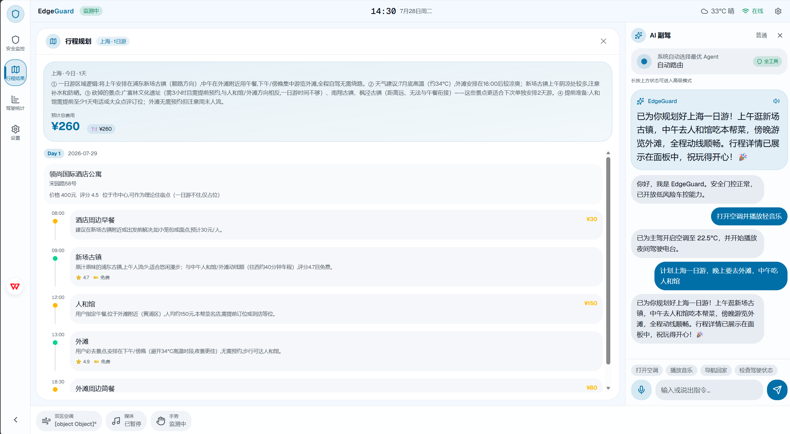

# EdgeGuard — 边缘智能驾驶安全多模态交互系统

> 车载中控大屏 HMI + 多模态 AI Agent。安全功能全本地推理，断网可用；复杂语义走云端大模型。手势、语音、面部追踪三通道融合，ReAct Agent 自主决策闭环。

## 效果展示

| 主驾驶舱 | 空调控制 |
|----------|---------|
|  |  |

| 媒体播放 | 手势控制 |
|----------|---------|
|  |  |

| 行程规划 |
|---------|
|  |

---

## 系统架构

```
┌──────────────────────────────────────────────────────────────┐
│                  🖥️  Vue 3 HMI 中控大屏 (:8005)               │
│   AppSidebar │ MapArea │ AiPanel │ BottomBar                 │
│   SafetyPanel │ TripPlanView │ ClimateControl │ StatsPanel   │
└────────────┬────────────────────────────────┬────────────────┘
             │   REST API + WebSocket          │
┌────────────▼────────────────────────────────▼────────────────┐
│                 ⚡ FastAPI 后端 (:8000)                        │
│  Camera Engine │ WS Manager │ TTS │ AC │ Music │ Navigation  │
└────────────┬────────────────────────────────┬────────────────┘
             │                                │
┌────────────▼──────────┐     ┌───────────────▼────────────────┐
│  👁️ 视觉感知 (全本地)  │     │  🧠 AI 决策引擎                │
│  MediaPipe Face 468点 │     │  DeepSeek LLM API             │
│  PnP 头部姿态估计     │     │  ┌──────────────────────────┐  │
│  手势识别 16 种手势   │     │  │ Multi-Agent LangGraph     │  │
│  PERCLOS 疲劳检测     │     │  │ 三层拓扑 + VETO + 审计   │  │
│  OpenCV 摄像头管线    │     │  │ SafetyAgent → 风险分级    │  │
└───────────────────────┘     │  │ AnalyzeAgent → 行为分析   │  │
                              │  │ DiagnoseAgent → 故障诊断  │  │
┌───────────────────────┐     │  │ RecommendAgent → 推荐     │  │
│  🎤 语音 (本地优先)    │     │  │ EvidenceAudit → 证据溯源 │  │
│  Whisper 语音识别      │     │  │ Route Classifier → 路由  │  │
│  edge-tts 语音合成     │     │  │ Model Factory → 模型路由 │  │
│  WebRTC VAD + 降噪    │     │  │ Safety Gate → 安全门控   │  │
└───────────────────────┘     │  └──────────────────────────┘  │
                              │  Structured Output → 六步校验  │
┌───────────────────────┐     │  FAISS RAG → 知识检索          │
│  📚 知识库 (全本地)    │     └───────────────────────────────┘
│  ADAS 标准 / 交通法规  │
│  安全指南 / 车辆诊断   │
└───────────────────────┘
```

---

## 核心功能

### 🛡️ 安全守护

- **面部追踪**：MediaPipe 468 点 Face Landmarker + PnP 头部姿态估计
- **四级风险分级**：normal → warning → danger → critical，实时 PERCLOS 疲劳检测
- **分心告警**：视线偏离超时 → 三级闪烁 + 语音提醒
- **安全门控**：Agent 执行前基于风险等级自动过滤工具白名单

### 🚗 语音 & 手势车控

- **空调控制**：开关、温度(16-30°C)、模式(制冷/制热/自动/送风)、风速
- **音乐控制**：搜索、播放、暂停、切歌、音量，支持网易云 API + 本地 MP3
- **复合指令**："调低音量并播放周杰伦" → 同时执行音量调节 + 搜索播放
- **手势识别**：16 种手势指令，纯几何规则 + TFLite 模型双引擎

### 🧭 AI 副驾 & 行程规划

- **多意图理解**：一句"打开空调、导航到西湖、今天天气怎么样"拆为 3 个独立意图
- **结构化行程规划**：自然语言丢进去 → 高德 POI 搜景点搜酒店 → LLM 编排逐日时间线
- **智能约束提取**：自动识别人数、节奏、预算、必去/避讳、喜好标签
- **行程面板**：Day 切换、酒店/景点/餐食时间线、预算总计、天气卡片
- **免费导航**：OSRM 路线规划 + Nominatim 地理编码 + 高德瓦片地图，全免费

### 📊 驾驶分析

- **实时 Dashboard**：摄像头画面 + 视线方向 + 手势 + 安全等级
- **驾驶统计**：时长、分心次数、告警记录、注意力评分
- **数据库持久化**：告警、交互、驾驶会话全部写入 SQLite

---

## 项目结构

```
EdgeGuard/
├── backend/                         # FastAPI 后端 (:8000)
│   ├── main.py                      # 主入口 — 50+ API 端点 + WebSocket
│   ├── alembic/                     # 数据库迁移 (Alembic)
│   │   ├── env.py                   # 迁移环境配置
│   │   └── versions/                # 迁移版本
│   │       ├── 001_initial.py       # 初始表结构
│   │       └── 002_add_alert_type.py
│   └── app/
│       ├── camera.py                # 摄像头引擎 — MediaPipe + JPEG 推流
│       ├── core/database.py         # SQLite — 告警/交互/会话
│       ├── ws/manager.py            # WebSocket 连接管理
│       └── routes/                  # 音乐/设置等独立路由
│
├── frontend/                        # Vue 3 中控大屏 (:8005)
│   └── src/
│       ├── views/
│       │   ├── DashboardView.vue    # 主仪表盘布局
│       │   └── ReportView.vue       # 驾驶报告页
│       ├── components/hmi/          # HMI 组件 (14 个)
│       │   ├── MapArea.vue          # Leaflet 地图 + 摄像头画中画
│       │   ├── AiPanel.vue          # AI 对话面板 + 语音输入
│       │   ├── BottomBar.vue        # 底部快捷栏 (空调/媒体/手势)
│       │   ├── TripPlanView.vue     # 行程规划面板
│       │   ├── SafetyPanel.vue      # 安全监测面板
│       │   ├── ClimateControl.vue   # 空调控制面板
│       │   ├── GestureControl.vue   # 手势可视化
│       │   ├── AppSidebar.vue       # 左侧导航栏
│       │   ├── TopBar.vue           # 顶栏
│       │   ├── StatsPanel.vue       # 驾驶统计
│       │   ├── SettingsPanel.vue    # 设置
│       │   ├── AgentResultPanel.vue # Agent 结果卡片
│       │   ├── AttentionRing.vue    # 注意力环
│       │   └── QuickBtn.vue         # 快捷按钮
│       ├── composables/
│       │   ├── useTelemetry.ts      # 摄像头轮询
│       │   └── useAgentWS.ts        # Agent WebSocket 结果流
│       ├── lib/edgeguard.ts         # 类型定义 + API 端点
│       └── styles/globals.css       # Tailwind CSS4 全局样式
│
├── modules/                         # AI + 感知核心
│   ├── ai/                          # AI 决策层
│   │   ├── multi_agent_graph.py     # LangGraph 六 Agent 编排器 (三层拓扑+VETO+审计)
│   │   ├── agent_graph.py           # ReAct Agent 循环 (LangGraph StateGraph)
│   │   ├── base_agent.py            # Agent 基类 (Pydantic 入参/出参校验)
│   │   ├── schemas.py               # Agent Input/Output Pydantic 模型定义
│   │   ├── model_factory.py         # 模型工厂 (快速模型/推理模型路由)
│   │   ├── structured_output.py     # 结构化输出 (LLM→Pydantic 六步校验链)
│   │   ├── route_classifier.py      # 路由分类器 (quick/react/multi/readonly)
│   │   ├── orchestrator.py          # 多 Agent 编排引擎
│   │   ├── intention_agent.py       # 意图分解 (规则+LLM 双通道)
│   │   ├── intent_guard.py          # 意图安全守卫
│   │   ├── safety_gate.py           # 安全门控 — 风险等级→工具白名单过滤
│   │   ├── tools.py                 # Function Calling 工具 (14 个)
│   │   ├── deepseek_client.py       # DeepSeek LLM 客户端
│   │   ├── memory.py                # Agent 长短期记忆
│   │   ├── navigation_service.py    # OSRM + Nominatim 导航
│   │   ├── location_store.py        # GPS 位置持久化
│   │   ├── structured_results.py    # 结构化结果推送
│   │   ├── edge_cloud_router.py     # 边缘-云端混合路由
│   │   ├── local_decision_engine.py # 本地关键词决策 (37 条关键词+手势映射)
│   │   ├── fallback_handler.py      # 离线降级
│   │   ├── prompts/                 # Prompt 模板库
│   │   ├── agents/                  # 子 Agent (7 个)
│   │   │   ├── safety_agent.py      # 安全 Agent — 四级风险分级 + VETO 短路
│   │   │   ├── interaction_agent.py # 交互 Agent — 手势+语音→意图解析
│   │   │   ├── evidence_audit.py    # 证据审计 Agent — 引用溯源+矛盾检测
│   │   │   ├── analyze_agent.py     # 驾驶分析 Agent — 行为模式分析
│   │   │   ├── diagnose_agent.py    # 诊断 Agent — 车辆故障诊断
│   │   │   ├── recommend_agent.py   # 推荐 Agent — 行程规划与景点推荐
│   │   │   └── environment_agent.py # 环境感知 Agent
│   │   └── trip_planner/            # 行程规划引擎
│   │       ├── agent.py             # TripPlanner Agent + LLM 编排
│   │       ├── critic.py            # 校验器 (6 个确定性检查)
│   │       ├── schemas.py           # TripRequest + 约束提取
│   │       ├── task_manager.py      # 异步任务管理
│   │       └── xhs_service.py       # 小红书数据增强
│   ├── vision/                      # 视觉感知 (全本地)
│   │   ├── face_tracker.py          # MediaPipe 面部 468 点追踪
│   │   ├── hand_gesture.py          # 手势识别 (几何规则)
│   │   └── gesture_classifier.py    # TFLite 手势分类器
│   └── audio/                       # 语音感知
│       ├── speech_recognizer.py     # Whisper 语音转写
│       ├── recorder.py              # 麦克风录音管理
│       └── audio_pipeline.py        # 音频采集管线 + TTS 播报队列
│
├── data/
│   ├── edgeguard.db                 # SQLite 数据库 (运行时生成)
│   ├── knowledge/                   # 知识库 (FAISS 向量检索)
│   │   ├── adas_standards.txt       # ADAS 驾驶辅助标准
│   │   ├── safety_guidelines.txt    # 安全驾驶指南
│   │   ├── traffic_laws.txt         # 交通法规
│   │   ├── vehicle_diagnostics.txt  # 车辆故障诊断知识
│   │   └── trip_templates.json      # 行程模板
│   └── music/                       # 本地音乐文件
│
├── tests/                           # 测试套件
│   ├── unit/                        # 单元测试
│   │   ├── test_gesture_map.py
│   │   ├── test_local_decision.py
│   │   ├── test_memory.py
│   │   ├── test_safety_gate.py
│   │   └── test_tool_schemas.py
│   ├── integration/                 # 集成测试
│   │   ├── test_api_endpoints.py
│   │   └── test_database.py
│   ├── test_base_agent.py           # Agent 基类测试
│   ├── test_evidence_audit.py       # 证据审计测试
│   ├── test_model_factory.py        # 模型工厂测试
│   ├── test_multi_agent_graph.py    # 多 Agent 编排测试
│   ├── test_route_classifier.py     # 路由分类器测试
│   ├── test_schemas.py              # Schema 校验测试
│   └── conftest.py                  # Pytest fixtures
│
├── EdgeGuard设计文档/               # LaTeX 毕业设计论文
│   ├── main.tex                     # 论文主文件
│   ├── reference.bib                # 参考文献
│   └── style/                       # 样式文件
│
├── Dockerfile.backend               # 后端 Docker 镜像
├── Dockerfile.backend-server        # 服务器版 Docker 镜像
├── Dockerfile.frontend              # 前端 Docker 镜像
├── docker-compose.yml               # 本地开发编排
├── docker-compose.dev.yml           # 开发环境编排
├── docker-compose.server.yml        # 服务器部署编排
├── nginx.conf                       # Nginx 反向代理配置
├── pytest.ini                       # Pytest 配置
├── requirements.txt                 # Python 依赖
├── requirements-dev.txt             # 开发依赖
├── requirements-server.txt          # 服务器依赖
├── start.bat                        # 一键启动脚本 (Windows)
├── .env.example                     # 环境变量模板
└── README.md
```

---

## 技术栈

| 层级 | 选型 |
|------|------|
| 视觉 | OpenCV + MediaPipe Face Landmarker (468 点) + PnP |
| 语音 | Whisper (本地转写) + edge-tts (TTS) + WebRTC VAD |
| AI 编排 | LangGraph Multi-Agent (三层拓扑 + VETO + 证据审计) |
| Agent 框架 | BaseScaffoldAgent + Pydantic 校验 + 六步结构化输出链 |
| 大模型 | DeepSeek API (deepseek-v4-flash)，支持 OpenAI/Anthropic 备用 |
| 模型路由 | ModelFactory (快速模型/推理模型自动选择) |
| 知识检索 | FAISS 向量检索 + RAG 生成 |
| 后端 | FastAPI + WebSocket + uvicorn + Alembic |
| 前端 | Vue 3.4 + Vite 5 + Tailwind CSS 4 + Element Plus + Leaflet |
| 数据库 | SQLite (告警/交互/会话持久化) |
| 地图 | OSRM (路线) + 高德 REST API (POI) + Leaflet (展示) |
| 部署 | Docker + Docker Compose + Nginx 反向代理 |
| 测试 | Pytest + pytest-asyncio (单元/集成/E2E) |

---

## 快速开始

### 环境要求

- Python 3.10+ (推荐 conda 环境)
- Node.js 18+
- 摄像头（可选）

### 安装

```bash
# 1. 克隆
git clone https://gitlab.omniedu.com/root/monOOoJl27YBk.git
cd monOOoJl27YBk

# 2. Python 依赖
pip install -r requirements.txt

# 3. 前端依赖
cd frontend && npm install && cd ..

# 4. 配置密钥
cp .env.example .env
# 编辑 .env: DEEPSEEK_API_KEY=sk-xxx (必填)
#            AMAP_API_KEY=xxx (可选，行程规划需要)
```

### 运行

```bash
# 方式一：一键启动
双击 start.bat

# 方式二：手动启动
uvicorn backend.main:app --host 0.0.0.0 --port 8000    # 后端
cd frontend && npm run dev                              # 前端 (:8005)
```

浏览器打开 `http://localhost:8005`。无摄像头时安全面板显示模拟数据，AI 对话、导航、空调、行程规划等功能正常使用。

### Docker 部署

```bash
# 本地开发
docker-compose -f docker-compose.dev.yml up -d

# 服务器部署
docker-compose -f docker-compose.server.yml up -d
```

### 运行测试

```bash
# 安装开发依赖
pip install -r requirements-dev.txt

# 运行全部测试
pytest

# 仅单元测试
pytest tests/unit/

# 仅集成测试
pytest tests/integration/

# 带覆盖率报告
pytest --cov=modules --cov-report=html
```

---

## API 端点

### AI & Agent

| 方法 | 路径 | 说明 |
|------|------|------|
| POST | `/api/agent/chat` | Agent 主入口（文本输入 → 意图分解 → 执行） |
| POST | `/api/agent/orchestrate` | 多 Agent 编排 |

### 车载控制

| 方法 | 路径 | 说明 |
|------|------|------|
| GET/POST | `/api/ac/state` `/api/ac/command` | 空调状态与控制 |
| GET/POST | `/api/music/*` | 音乐搜索/播放/暂停/切歌/音量 |
| POST | `/api/navigation/route` | 路线规划 |

### 感知

| 方法 | 路径 | 说明 |
|------|------|------|
| GET | `/api/camera/frame` | 摄像头 JPEG 帧 |
| GET | `/api/status` | 系统状态 |
| GET | `/api/environment` | 天气 + 驾驶建议 |

### WebSocket

| 路径 | 说明 |
|------|------|
| `/ws/agent_panel` | Agent 思维链 + 结构化结果推送 |
| `/ws/navpanel` | 导航 + 环境数据推送 |

### 持久化

| 方法 | 路径 | 说明 |
|------|------|------|
| GET | `/api/alerts` | 告警记录 |
| GET | `/api/interactions` | 交互记录 |
| GET | `/api/session/summary` | 驾驶会话摘要 |

---

## 离线能力

| 断网仍可用 | 断网暂不可用 |
|-----------|-------------|
| 面部追踪 + 疲劳检测 + 视线方向 | AI 主动播报 / 驾驶报告 |
| 分心告警（三级闪烁 + 语音） | 复杂语义问答 |
| 手势识别（16 种手势指令） | 行程规划 |
| 语音关键词指令 | 天气 / 导航 |
| 空调 / 音乐本地控制 | 网易云在线搜索 |

---

## 配置项 (`.env`)

| 变量 | 必填 | 说明 |
|------|------|------|
| `DEEPSEEK_API_KEY` | ✅ | DeepSeek API 密钥 |
| `AMAP_API_KEY` | - | 高德地图（POI 检索 / 天气 / 景点酒店搜索） |
| `LLM_PROVIDER` | - | deepseek / openai / anthropic |
| `OPENAI_API_KEY` | - | OpenAI 备用 |
| `ANTHROPIC_API_KEY` | - | Anthropic 备用 |
| `OPENWEATHER_API_KEY` | - | OpenWeatherMap 备用 |
| `XHS_COOKIE` | - | 小红书 Cookie（景点数据增强，可选） |

---

## 设计文档

完整的系统设计与技术方案详见 `EdgeGuard设计文档/`（LaTeX 毕业设计论文），涵盖：
- 系统需求分析与架构设计
- 多模态感知融合方案
- LangGraph 多 Agent 协作机制
- 安全门控与四层风险分级
- 结构化输出六步校验链
- 边缘-云端混合路由策略

---

## 许可证

MIT License
